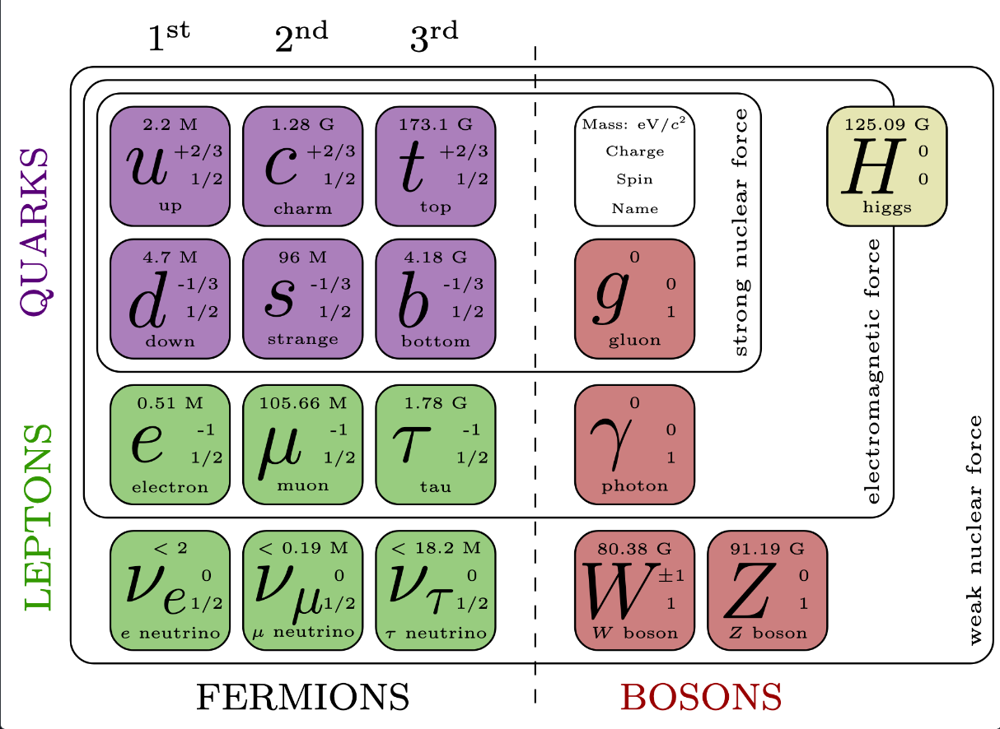
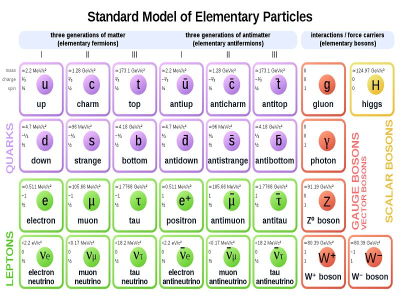
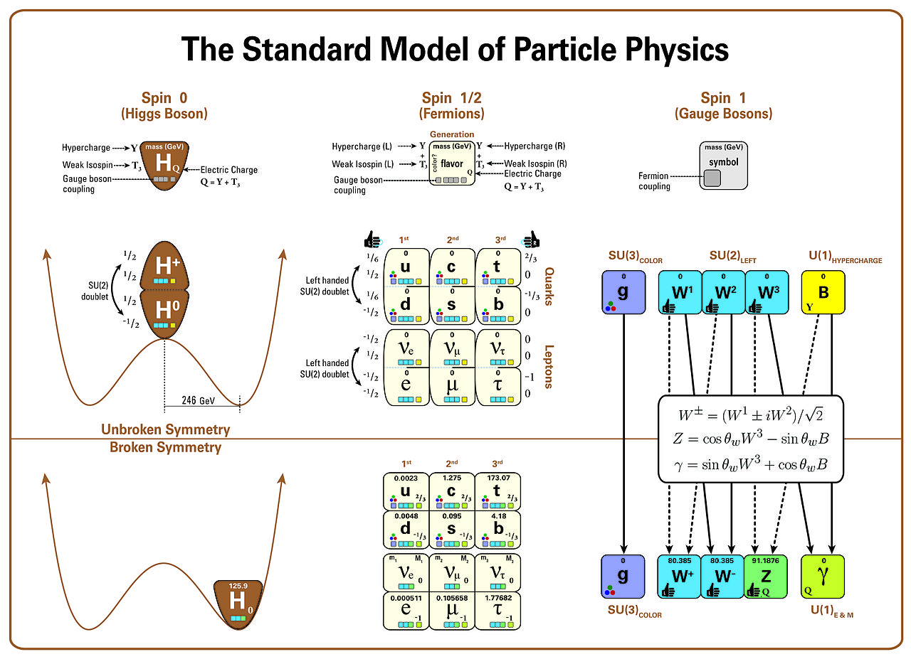

# Standard Model Cheatsheets

This repository contains LaTeX code and reference materials to generate a visualization of the Standard Model of particle physics. The provided `.tex` file allows you to produce a diagram that illustrates the fundamental particles and their interactions.

## Features
- LaTeX code for rendering the Standard Model diagram.
- Customizable elements for different representations and updates.
- Clear structure for easy integration into research papers or presentations.

## Original Inspirations / Authors
- [Matic Lubej](https://github.com/mlubej/standard-model)
- [David Galbraith](https://davidgalbraith.org/portfolio/ux-standard-model-of-the-standard-model/) & [Carsten Burgard](https://texample.net/tikz/examples/model-physics/)
- [Izaak Neutelings](https://tikz.net/sm_particles/)

## License
This project is licensed under the [GNU General Public License v3.0](https://www.gnu.org/licenses/lgpl-3.0.html) — see the [LICENSE](LICENSE) file for details.

## Contributions
Feel free to fork the repository and submit pull requests for any improvements or additions to the diagram, such as new particle representations or annotations. Contributions are welcome!

## Other Examples

##  Other interesting infographics
- [https://www.symmetrymagazine.org/standard-model/](https://www.symmetrymagazine.org/standard-model/)
- [https://www.behance.net/gallery/17666857/5sigma-a-new-visual-language-for-elementary-particles](https://www.behance.net/gallery/17666857/5sigma-a-new-visual-language-for-elementary-particles)
- [https://www.reddit.com/r/Physics/comments/7jib36/i_made_a_chart_of_the_standard_model_of_particle/#lightbox](https://www.reddit.com/r/Physics/comments/7jib36/i_made_a_chart_of_the_standard_model_of_particle/#lightbox)
- [https://infoingraph.com/infographic/standard-model-of-fundamental-particles-and-interactions/](https://infoingraph.com/infographic/standard-model-of-fundamental-particles-and-interactions/)
- [https://commons.wikimedia.org/wiki/File:Standard_Model_Of_Particle_Physics,_Most_Complete_Diagram.jpg](https://commons.wikimedia.org/wiki/File:Standard_Model_Of_Particle_Physics,_Most_Complete_Diagram.jpg)
- [https://commons.wikimedia.org/wiki/File:Standard_Model_of_Elementary_Particles_Anti.svg](https://commons.wikimedia.org/wiki/File:Standard_Model_of_Elementary_Particles_Anti.svg)
-  
- 
- ... [(many more!)](https://www.google.com/search?sca_esv=eb368db2b3cdf9ce&sxsrf=ADLYWIIfdQA8NUF0MjDERNPuWnzTcFAdcQ:1733323015493&q=standard+model+infographic&udm=2&fbs=AEQNm0AhtDknupEF8_qTQA8ksbc_ApAFdfCx4z-pmFMoZwUOPJaCnYygt8FiZDPTsw4TuYYnbiJmCbdVpJAwkCqxA4UGMw7Us2Jwiz61U6ZMWTB4wBLpmIgjem61k3P8Ml0LxrSWzqqWbE3RKWGTN9O57LCpxY7pLB6MO7YJmzl_DIvllNbQkj7YsMHu8RplGiWSihFTzVHf&sa=X&ved=2ahUKEwjF1vm0q46KAxWxAvsDHbigOuAQtKgLegQIERAB&biw=1920&bih=932&dpr=1#vhid=nsNrDTiIktNelM&vssid=mosaic)

